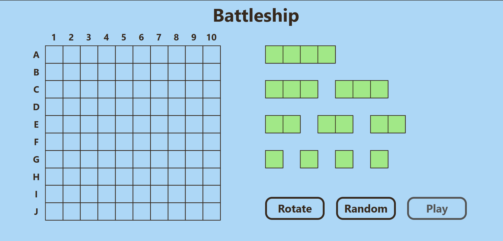
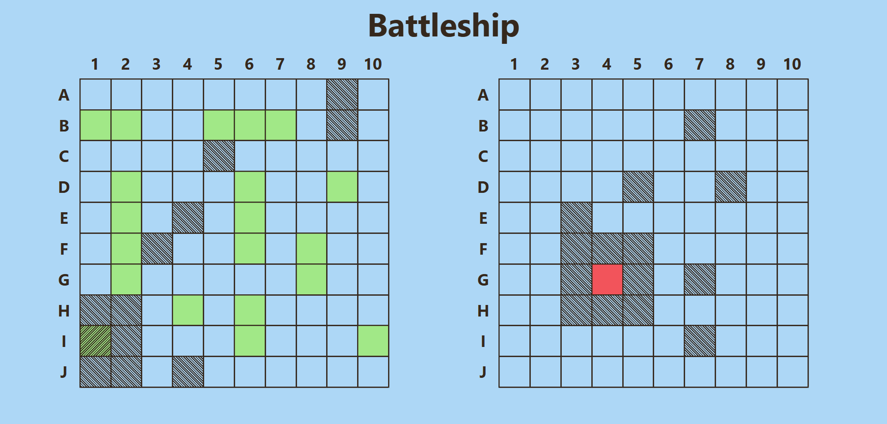

# 🔫 Battleship Game

A web-based implementation of the classic **Battleship** game. Place your fleet, take turns with the computer, and try to sink all enemy ships before yours go down!

> 🎓 Built as part of [The Odin Project](https://www.theodinproject.com) curriculum.

---

## 🚀 Live Preview

🔗 [Play on GitHub Pages](https://wrzdx.github.io/Battleship/)  

---

## 📸 Screenshots

### Ship Placement Phase


### Battle Phase


---

## 🛠 Features

- Drag-and-drop ship placement
- Rotate ships
- Random ship placement option
- Turn-based gameplay with a simple AI
- Victory/defeat screen with "Play Again" option

---

## 📦 Technologies

- Vanilla JavaScript (ES6+)
- HTML & CSS (Grid Layout)
- DOM manipulation
- Modular JavaScript (ES Modules)

---

## 📁 How to Run Locally

1. Clone the repo:

```bash
git clone https://github.com/your-username/battleship.git
cd battleship
```

2. Install dependencies:
```bash
npm install
```

3. Start development server:
```bash
npm webpack serve
```

4. Open `http://localhost:8080` in your browser

